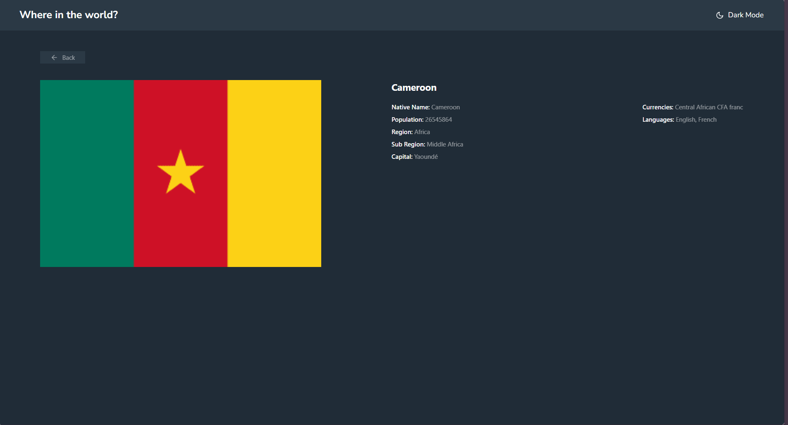

# Frontend Mentor - REST Countries API with color theme switcher solution

This is a solution to the [REST Countries API with color theme switcher challenge on Frontend Mentor](https://www.frontendmentor.io/challenges/rest-countries-api-with-color-theme-switcher-5cacc469fec04111f7b848ca). Frontend Mentor challenges help you improve your coding skills by building realistic projects. 

## Table of contents

- [Overview](#overview)
  - [The challenge](#the-challenge)
  - [Screenshot](#screenshot)
  - [Links](#links)
- [My process](#my-process)
  - [Built with](#built-with)
  - [What I learned](#what-i-learned)
  - [Continued development](#continued-development)
  - [Useful resources](#useful-resources)
- [Author](#author)
- [Acknowledgments](#acknowledgments)

## Overview

### The challenge

Users should be able to:

- See all countries from the API on the homepage
- Search for a country using an `input` field
- Filter countries by region
- Click on a country to see more detailed information on a separate page
- Click through to the border countries on the detail page
- Toggle the color scheme between light and dark mode *(optional)*

### Screenshot

### Links

- Solution URL: [Add solution URL here](https://your-solution-url.com)
- Live Site URL: [Add live site URL here](https://your-live-site-url.com)

## My process

### Built with

- Semantic HTML5 markup
- CSS custom properties
- Flexbox
- CSS Grid
- Mobile-first workflow
- Tailwind
- [Typescript] (https://v2.tailwindcss.com/) - Tailwind Docs
- [React](https://reactjs.org/) - JS library

### What I learned

This the first time I use an API with react, its the first time I even use react..😅😅
So I can say I learnt a lot about react, like the whole code is a lesson

### Continued development

I'll really like to come back and work on my api fetching method, cause for now, if the pages loads before the fetch, the page will not be refreshed.

### Useful resources

- [Tailwind docs](https://v2.tailwindcss.com/docs) - The tailwind docs really helped me getting throught it all.

## Author

- Portfolio - (https://mbungai-francesco.github.io/Portfolio/)
- github - [Forche Mbungai Francesco](https://github.com/Mbungai-Francesco)
- Frontend Mentor - [@Mbungai-Francesco](https://www.frontendmentor.io/profile/Mbungai-Francesco)
- Twitter - [@MbungaiF](https://twitter.com/MbungaiF)

## Acknowledgments

I thank God for the strength and resources he keeps sending my way.
